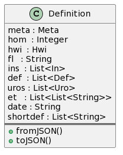

# <u>Project Architecture</u>

Section Links:

* [Introduction](#introduction)
* [Folder Structure](#folder-structure)
* [Project Architecture](#project-architecture)
    + [Project Diagram](#uml-diagram)
* [Definition Data Structure](#definition-data-structure)
    + [Definition UML](#definition-uml)
* [Testing](#testing)

## <u>Introduction</u>

Our project is a small collection of retro games. The main three games we've settled on at this point are Hangman, Tic-tac-toe, and Solitaire. One of the major changes to Hangman that we're going to implement a pop-up upon success/failure of the Hangman game, which displays the definition of the word used in that round. This is facilitated with the Merriam-Webster's Colliegate Dictionary API.

 
---
## <u>Folder Structure</u>

The basic folder structure for our project is as follows

<pre>
/ (project root)
├── docs/
│   ├── architecture.md
│   ├── gherkin_testing.md
│   ├── organization.md
│   ├── proposal.md
│   ├── sprint1.md
│   └── **and more**
├── src/
│    ├── assets/
│    │   ├── images/     
│    │   │   └── *.png / *.jpeg
│    │   └── json/
│    │       └── *.json             
│    ├── lib/
│    │   ├── models/
│    │   │   ├── definition_page.dart
│    │   │   └── merriam_webster_api.dart
│    │   └── screens/
│    │       ├── definition_page.dart
│    │       ├── hangman.dart
│    │       ├── solitaire.dart
│    │       ├── tests_page.dart
│    │       └── tictactoe.dart
│    └── test/
│        ├── features/
│        │   ├── *.feature
│        ├── step/
│        │   ├── **Gherkin generated tests**
│        ├── hangman_test.dart
│        ├── merriam_webster_api_test.dart
│        ├── merriam_webster_api_test.mocks.dart
│        ├── widget_test.dart
│        └── ***more tests***    
├── .gitignore
├── AUTHORS
├── LICENSE
└── README.md
</pre>

Common Dart naming convention suggests, in the lib folder, grouping pages that would be displayed into a seperate screens folder, and any code that does not involve the front end code, is contained in a models folder.

---

## <u>Project Architecture</u>

The diagram below demonstrates the main pages will interact with each other. One key thing to note is that the Hangman class references a Defintion class. This is the large JSON response, we get from the Merriam-Webster's API, which we've implemented as various classes, to accomodate the complex JSON that needs to be parsed. A

Otherwise, all pages have links to the other pages included in the project.
### <u>UML Diagram:</u>

---

## <u>Definition Data Structure</u>

According to the documentation provided by the Merriam Webster's Collegiate Dictionary, when we make a JSON request, the format that the API returns you ends up being something like this:

### <u>Definition UML:</u>

For the purposes of this project, we at most will just be using the shortdef field and potentially the et field. Shortdef gives you a short definition of the requested word. Et is short for etymology, and offers some interesting information about the word.

---

## <u>Testing</u>

For our tests, we intend to utilize a mix of Mockito for mocking, Cucumber/Gherkin for generating BDD style test cases, and both of these work with the testing framework offered by Flutter, and are optional for the testing being done.